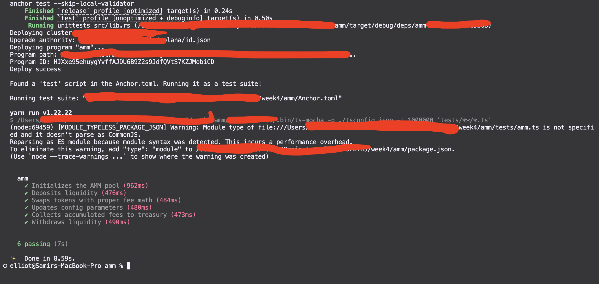

# Constant Product AMM (Automated Market Maker)

A Constant Product Automated Market Maker (AMM) built from scratch on Solana using the **Anchor Framework**. This project implements a Uniswap V2-style pool utilizing the standard constant product formula $x \times y = k$ to enable decentralized token swaps, liquidity provision, and fee collection.

---

## 📐 Architecture & Math

This AMM uses the **SPL LP Token architecture** to represent pool ownership. When users deposit liquidity, they are minted LP (Liquidity Provider) tokens. When they withdraw, their LP tokens are burned in exchange for their share of the pool's underlying reserves.

### 1. Constant Product Formula
The swap price and output are dictated by:
$$x \cdot y = k$$
where:
* $x$ is the reserve of Token X (`vault_x`)
* $y$ is the reserve of Token Y (`vault_y`)
* $k$ is a constant invariant that must remain unchanged (or increase due to fees) after a swap.

### 2. Deposit Math
When depositing liquidity into an existing pool:
$$\Delta y = \frac{\text{LP to mint}}{\text{LP supply}} \cdot y$$
$$\Delta x = \frac{\text{LP to mint}}{\text{LP supply}} \cdot x$$
The user specifies the desired LP amount to mint, and the program calculates the proportional amount of Token X and Y they need to transfer.

### 3. Swap Math
The output amount for swapping $\Delta x$ of Token X for Y with fee $f$ (in basis points) is:
$$\Delta y = \frac{\Delta x \cdot (1 - f) \cdot y}{x + \Delta x \cdot (1 - f)}$$
Fees accumulate directly inside the vaults and are tracked in the state configuration (`fee_x_pending` and `fee_y_pending`) to be collected by the pool authority.

---

## 🛠️ Program Instructions

The program exposes the following instructions:

1. **`initialize`**: Initializes the AMM pool config, creates the LP token mint, and sets up vault token accounts for Token X and Y.
2. **`deposit`**: Deposits Token X and Y into the pool vaults proportionally and mints LP tokens to the provider.
3. **`withdraw`**: Burns LP tokens to redeem a proportional share of the Token X and Y reserves.
4. **`swap`**: Performs a swap (Token X for Y or vice versa) using the constant product formula and collects the fee.
5. **`update_config`**: Admin instruction to lock/unlock the pool, update fees, or transfer authority.
6. **`collect_fees`**: Transfers the accumulated pending fees from the vaults to the treasury accounts.

---

## 📁 Account Structures

### Config PDA
State account that holds configuration and bookkeeping information:
* `seed`: Unique identifier (seed) for deriving the Config address.
* `authority`: Optional admin key.
* `mint_x` / `mint_y`: Mint addresses for the pool tokens.
* `fee_basis_points`: Pool fee in bps (e.g., 30 = 0.3%).
* `locked`: Boolean flag to pause deposits/withdrawals/swaps.
* `fee_x_pending` / `fee_y_pending`: Bookkeeping for accumulated fees.
* `config_bump` / `lp_bump`: Saved bumps for PDA verification.

---

## 🧪 Testing

### Prerequisites
* Rust & Cargo
* Solana CLI (Agave 3.x)
* Anchor CLI (`v1.0.2` or later)
* Node.js & Yarn

### Running the Test Suite
Because the latest Anchor uses `surfpool` by default, if you don't have it installed, you should run the tests using your local legacy validator:

1. Start a local Solana validator in a separate terminal:
   ```bash
   solana-test-validator --reset --quiet
   ```

2. Run the Anchor tests pointing to the active validator:
   ```bash
   anchor test --skip-local-validator
   ```

### Test Coverage Results


